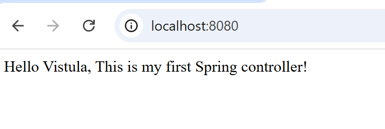
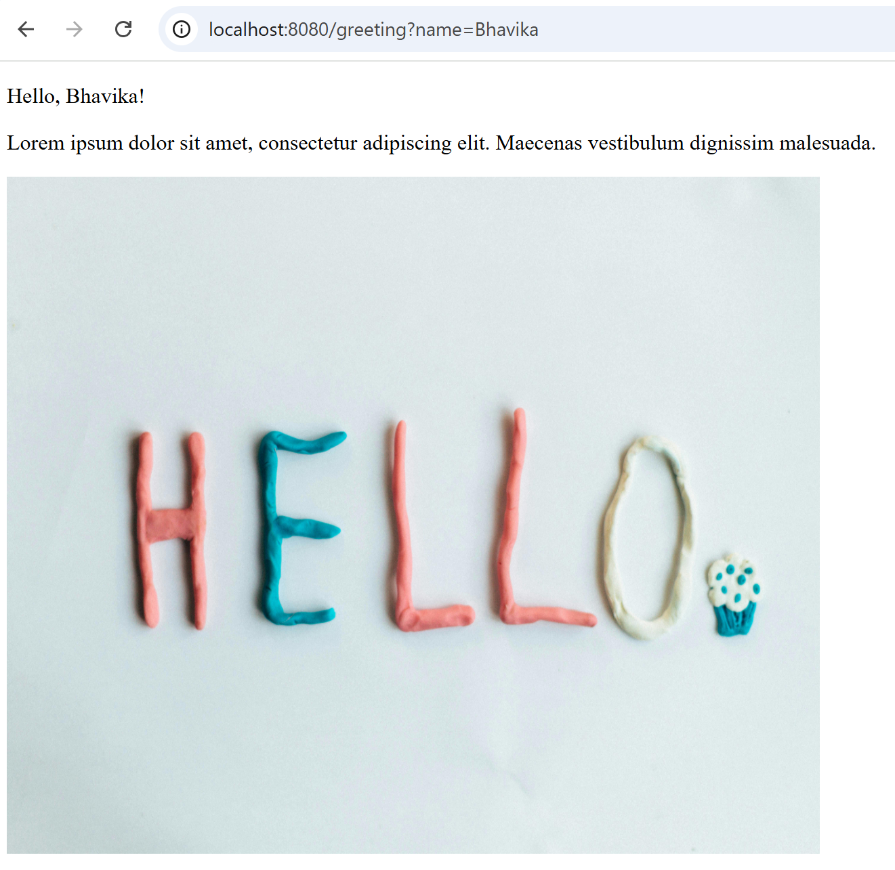
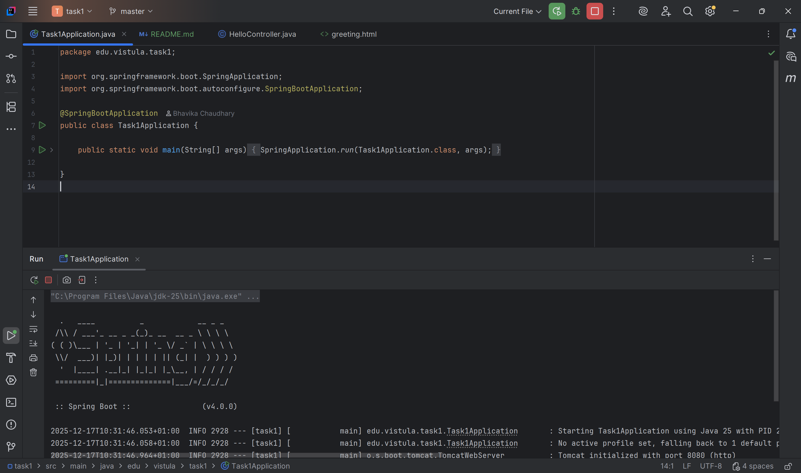
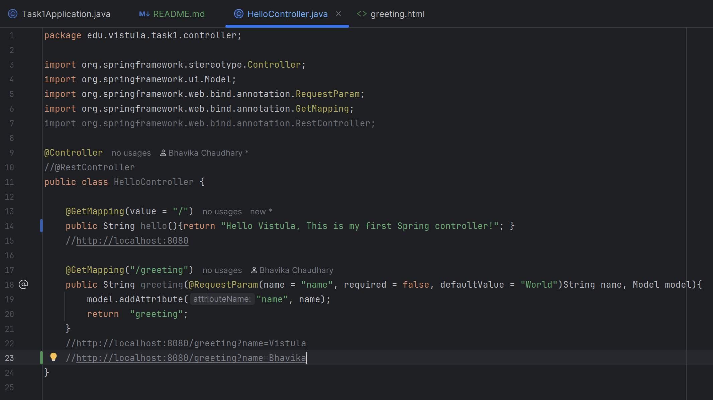
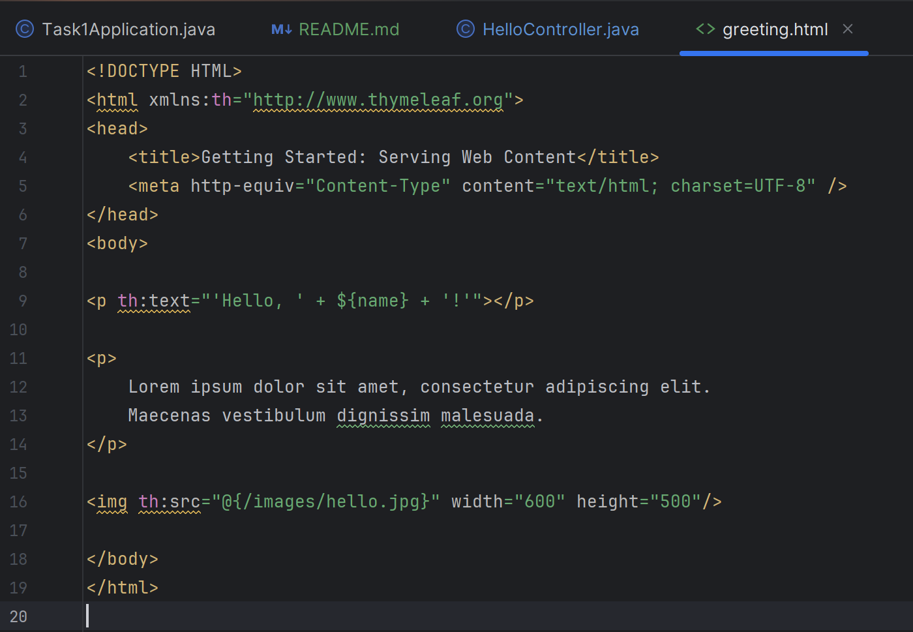
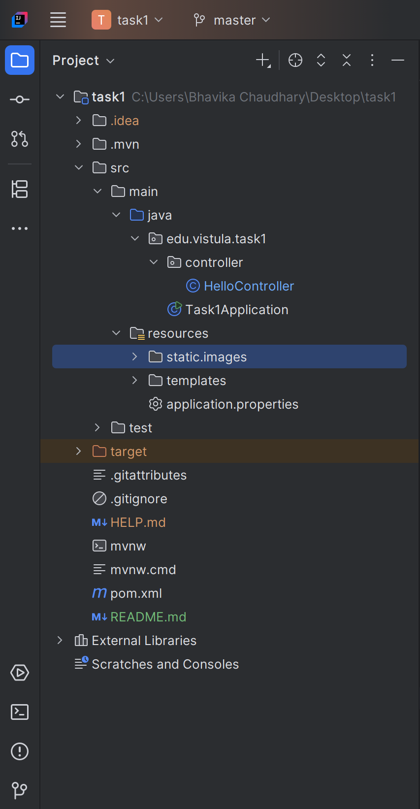

# University Spring Boot Project - Task 1

## Student Details
- **Name:** Bhavika Chaudhary
- **Student ID:** 73586


## Project Description
This project is a simple Spring Boot web application built using Java and Maven. It demonstrates the basic working of Spring Boot using the _MVC (Model–View–Controller) architecture_ and _RESTful web services_. The project shows the basic functionality of a REST controller by returning a greeting message to handle a HTTP GET request. Also, the message is customized using a URL parameter provided in the GET request.

## Technologies Used
- Java
- Spring Boot
- Maven
- IntelliJ IDEA

## How to Run the Project 
1. **Copy and go to the repository:**
   ```
   https://github.com/Bhavika-Chaudhary/Spring_framework_and_java_task1.git

2. Open the project in **IntelliJ IDEA**.
3. Run the main class: Task1Application.java
4. Open this link in a web browser http://localhost:8080/greeting?name=Vistula 
   or click [here](http://localhost:8080/greeting?name=Vistula) to run. 
(You can also change the name from Vistula to whatever you like and the message will change accordingly.)

## Result  
A web page shows a greeting message, some random text and an image.

##  Use Cases
- **Precondition:** Application (Task1Application.java) is running for all cases.
- Stop and run the application again after implementing any changes to the code.

### Use Case 1: Display First Controller
**Steps:**
1. Open the project in **IntelliJ IDEA**.
2. Go to class HelloController.java.
3. Uncomment @RestController and comment out @Controller to see the output for this case.
4. Go to this link http://localhost:8080 or click [here](http://localhost:8080)

**Expected Result:**  
A greeting message and some text is shown on the web page.

**Screenshot:**
<p align="left">
  
</p>

### Use Case 2: Display Greeting Page

**Steps:**
1. User opens a browser
2. User enters the URL with a name parameter: http://localhost:8080/greeting?name=Vistula

**Expected Result:**  
A greeting message is displayed on the web page.

**Screenshot:**  
<p align="left">
  
</p>

### Use Case 3: Greeting with Different Name

**Steps:**
1. User changes the name parameter in the URL: http://localhost:8080/greeting?name=Bhavika

**Expected Result:**  
The greeting message updates dynamically based on the new name.

**Screenshot:**  
<p align="left">
  
</p>

## Code
**CASE 1:**
```
package edu.vistula.task1.controller;

import org.springframework.web.bind.annotation.GetMapping;
import org.springframework.web.bind.annotation.RestController;

@RestController
public class HelloController {

    @GetMapping(value = "/")
    public String hello(){return "Hello Vistula, This is my first Spring controller!"; }
    }
```

**CASE 2 and 3:**
```
package edu.vistula.task1.controller;

import org.springframework.stereotype.Controller;
import org.springframework.ui.Model;
import org.springframework.web.bind.annotation.RequestParam;
import org.springframework.web.bind.annotation.GetMapping;

@Controller
//@RestController
public class HelloController {
@GetMapping("/greeting")
    public String greeting(@RequestParam(name = "name", required = false, defaultValue = "World")String name, Model model){
        model.addAttribute("name", name);
        return  "greeting";
    }
  }  
```
**SCREENSHOT OF THE CODE RUNNING**

- Application running in IntelliJ IDEA:
<p align="left">
  
</p>

- HelloController.java: 
<p align="left">
  
</p>

- greeting.html:
<p align="left">
  
</p>

- Project Structure:
<p align="left">
  
</p>

## Static Resources

The project includes a static image which is used in the project and the screenshots of the application running, located in: **src/main/resources/static/images/**_name_of_the_image_or_screenshot_

The image is displayed on the greeting page using Thymeleaf.

## Learning Outcomes

Through this task, the following concepts were practiced:
- Creating a Spring Boot application
- Using controllers to handle HTTP requests
- Passing parameters via URL
- Rendering dynamic HTML using Thymeleaf
- Serving static resources in Spring Boot

## Conclusion
This project provided an introduction to building RESTful applications using Spring Boot. The main learning outcomes 
include understanding how to set up a Spring Boot project, configure Maven, and create a simple REST controller. 
It demonstrates the fundamental concepts of handling HTTP requests and returning dynamic responses in a beginner-friendly manner.
